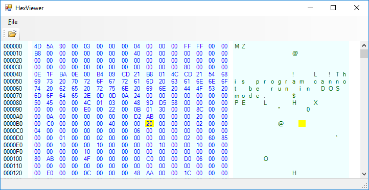

HexViewer Sample
================

A simple application to open and display a file (document) as a hexadecimal 
byte array, illustrated below.

The sample illustrates how to use some features of Kajabity.DocForms module including the following:
-	Use of ``SingleDocumentForm`` base class to provide file handling features.
-	Open a file.
-	Recent file handling.
-   Drag and Drop files.
-	Extending the ``Document`` and ``SingleDocumentManager`` base classes to implement ``BinaryDocument`` and ``BinaryDocumentManager`` classes.

The display is implemented using the ``HexPanel`` UserControl which extends Panel and draws the hexadecimal and character bytes using double buffering.  Mouse tracking is used to highlight individual hex and character bytes as the mouse moves over the panel.  Unused menu and toolbar items have been hidden - perhaps to be implemented later.

More information is available at [http://www.kajabity.com/kajabity-tools/](http://www.kajabity.com/kajabity-tools/).
