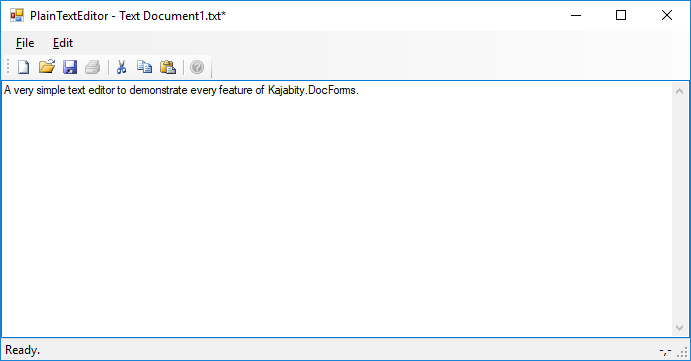

PlainTextEditor Sample
======================

This simple text editor application is intended to demonstrate every feature of Kajabity.DocForms.

All of the application and file handling features are implemented using Kajabity.DocForms.  The text editor itself is based on a TextBox control with some methods linked to standard menu items and toolbar buttons.

_Node, the undo feature in a TextBox only supports undoing the last edit.  This means that once modified, the 'Modified' status can only be removed by saving/closing the document._

More information is available at [http://www.kajabity.com/kajabity-tools/](http://www.kajabity.com/kajabity-tools/).
